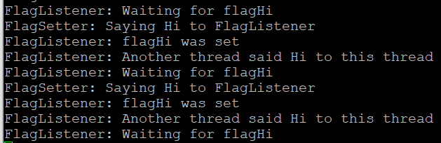

# User Manual CleanRTOS testen met Stm32CubeIDE

Uitgebreide informatie over wat CleanRTOS is, is [hier te vinden](https://github.com/HU-TI-DEV/TI-S3/tree/main/infrastructuur/CleanRTOS).

In dit document wordt je aan de hand genomen om het te gebruiken op Stm microcontrollers, via STM32CubeIDE.

De meest recente commit is inmiddels succesvol getest op:

- STM32F401CCU (een blackpill variant, STM32F4xx_hal familie)

- STM32WLE5JC (STM32WLxx_hal familie)

Idealiter zou je gewoon een kant en klaar project willen om CleanRTOS (of wat dan ook) te kunnen testen op elke STM microcontroller (zoals bij ESP-IDF, via set-target). Helaas is dat bij Stm niet mogelijk: Een Stm CubeIDE project moet speciaal worden aangemaakt voor de specifieke microcontroller familie die je gebruikt. 

In onderstaande manual nemen we je daarbij bij de hand. 

Voor wie gewend is met STM32CubeIDE te werken zal onderstaande manual gedetailleerder zijn dan nodig.

## In grote lijnen

In grote lijnen is dit het proces dat in onderstaand document doorlopen wordt:

1. Download en installeer Stm32CubeIDE.

2. Creëer nieuw project op basis van de gewenste chip.

3. Importeer de CleanRTOS library in je project.

4. Configureer FreeRTOS middleware.

5. Configureer uart of uart2 voor debug/test logging.

6. Include en exececuteer de gewenste applicaties vanuit main.c.

## Stap voor Stap

- **Download en installeer Stm32CubeIDE**.

- Stm32CubeIDE -> **new Project**

- Kies op de **MCU Selector Tab** de processor, gevolgd door Next.
  Bijvoorbeeld de processor van Seeed LoRaWAN e5 mini is: STM32WLE5JCI6

- Vul de gewenste **projectnaam** in.

- Kies **C++** als target language.

- Laat targeted project type staan op **STM32Cube**.

- Dubbelklik in het project op de **.ioc** file.

- Project manager->code generator->radio: "copy only the necessary library files".

- Dubbelklik op **Pinout&Configuration->Middleware->FREERTOS**

- ->Interface : **CMSIS_V2**

- en freertos tabblad config parameters: 
  verander **TOTAL_HEAP_SIZE** naar **15000** bytes **en druk return!** (als je alleen wegklikt, wordt het niet opgeslagen).
  controleer verder dat Memory management scheme op "heap 4" staat en TICK_RATE_HZ op 1000.

- en freertos tabblad advanced settings:
  **USE_NEWLIB_REENTRANT->Enabled**

- Om FreeRTOS warning weg te krijgen: **Pinout & configuration->system core->sys->TImebase Source-> kiest TIM7, TIM5 of Tim17 (liefst een 32 bits, maar in ieder geval NIET Tim2)**.

- Wijzig evt **ClockConfiguration -> SYSCLK** naar believen, door deze via **PLLCLK** te laten lopen en te spelen met de voorafgaande multipliers (op de lorawan e5 mini kun je tot 48MHZ instellen).

- **Connectivity → USART2 → Mode: Asynchronous** (Enable).

- Ga in een cmd prompt naar de projectfolder (waar zich de .ioc file bevindt), maak een Libraries folder aan en **clone** er CleanRTOS onder de naam CleanRTOS:

- ```bash
  mkdir Libraries
  cd Libraries
  git clone https://github.com/TheMave/CleanRTOS_Stm CleanRTOS
  ```

- **Of** als **alternatief** voor clonen als bovenstaand - **als je nieuwe project een eigen git heeft**, kun je CleanRTOS als **submodule** toevoegen:
  
  - ```bash
    git submodule add <git-url-extern> Libraries/CleanRTOS/<naam>
    git commit -m "Add CleanRTOS as submodule"
    ```

- Klik in CubeIDE op het project in de **Project Explorer** tab, en druk F5 (**refresh**).
  Je ziet nu de Libraries folder met CleanRTOS subfolder in het project verschijnen.

- Open **main.h**, in **Core/Inc**
  **Kijk naar de bovenste include**.
  Dat is de include van de HAL van je microcontroller familie.
  Bijvoorbeeld:  `#include "stm32wlxx_hal.h"`

- voeg een file genaamd `crt_stm_hal.h` toe aan de folder "Core\Inc", en zet daarin de include die je vond in de vorige stap:
```h
// Copy to this location the hal include for the current stm mcu
// It is the first include that you can find in Core/Inc/main.h

// #include "stm32f4xx_hal.h" // for hl serie (blackpill, STM32F401CCU)
#include "stm32wlxx_hal.h" // for wl serie (lorawan e5 mini, STM32WLE5JC)
```

Iets soortgelijks voor de core dependency:
- voeg een file genaamd `crt_core_cm.h` toe aan de folder "Core\Inc", en zet daarin de volgende code:
```h
- Open **CleanRTOS/src/internals/stmHwTimer2.c**
  Pas daar eventueel de include aan:
   #include "core_cm4.h" // of core_cm3.h / core_cm7.h afhankelijk van je MCU`
```

Middels die file configureer je CleanRTOS voor een bepaalde Stm serie.

- Voor debug/logging gebruiken we usart**2** (uart wordt bijvoorbeeld bij de e5 mini al gebruikt voor comms met de lora module):

- **Connectivity → USART2 → Mode: Asynchronous** (Enable).

- **Pinout:** kies **PA2 = USART2_TX**, **PA3 = USART2_RX**.
  (althans.. bij de e5 mini - check je microcontroller pinout voor de zekerheid)

- Controleer op de bijbehorende **tab** "parameter settings" dat de baudrate op 115200 staat.

- In de **Pinout view** zet je **PA15 → I2C2_SDA** en **PB15 → I2C2_SCL**.
  (althans: bij de e5 mini - check je microcontroller pinout voor de zekerheid)

- Vervolgens **Connectivity → I2C2 → Mode: I2C** (enable).

- zorg **zelf** voor pull-ups (4.7k) naar 3.3V

- Zet **Trace&Debug** op **Serial Wire**, zodat PA15 niet door JTAG(JTDI) bezet wordt.

- Voor de **NRST** (hardware reset pin) is kennelijk geen ioc config nodig.

- Save (de ioc, ignore de warning t.a.v. freertos timer source)

Nu gaan we de include paden snel toevoegen:

- open in een texteditor (zoals notepad++) **.cproject**

Zet onder de include path options overal onder 

`<listOptionValue builtIn="false" value="../Drivers/CMSIS/Include"/>`

de volgende paths erbij(copy paste):

```xml
<listOptionValue builtIn="false" value="../Libraries/CleanRTOS/src"/>
<listOptionValue builtIn="false" value="../Libraries/CleanRTOS/examples/Flag"/>
<listOptionValue builtIn="false" value="../Libraries/CleanRTOS/examples/Queue"/>
<listOptionValue builtIn="false" value="../Libraries/CleanRTOS/examples/Time"/>
<listOptionValue builtIn="false" value="../Libraries/CleanRTOS/examples/Timer"/>
<listOptionValue builtIn="false" value="../Libraries/CleanRTOS/examples/Pool"/>
<listOptionValue builtIn="false" value="../Libraries/CleanRTOS/examples/MutexSection"/>
<listOptionValue builtIn="false" value="../Libraries/CleanRTOS/tests/Timer"/>
<listOptionValue builtIn="false" value="../Libraries/CleanRTOS/src/internals"/>
<listOptionValue builtIn="false" value="../Libraries/CleanRTOS/src/internals/tests/TestLed"/>
<listOptionValue builtIn="false" value="../Libraries/CleanRTOS/src/internals/tests/IndexPool"/>
<listOptionValue builtIn="false" value="../Libraries/CleanRTOS/src/internals/tests/StmHwTimer"/>
<listOptionValue builtIn="false" value="../Libraries/CleanRTOS/src/internals/tests/Timers"/>
```
(dus in totaal bij 4 include paths, voor gc debug, gcc debug, gc release en gcc release)

Als het goed is zijn de subfolders van `../Middlewares/Third_Party/FreeRTOS/Source/` al toegevoegd. Zo niet, dan kun je dat later vanuit de project properties toevoegen.

Zo gaan we ook de folders met linker sources toevoegen:

- En voeg toe aan **beide** `<sourceEntries>` secties:

```xml
<entry flags="VALUE_WORKSPACE_PATH|RESOLVED" kind="sourcePath" name="Libraries/CleanRTOS/src/internals"/>
```
.. en evt `<entry flags="VALUE_WORKSPACE_PATH|RESOLVED" kind="sourcePath" name="Middlewares"/>`mocht dat er nog niet bij staan.

- **Save** de .cproject. 

- **Sluit** de CubeIDE en open hem opnieuw (dan pas zie je textuele aanpassingen van .cproject terug). 

- RMB op het project->properties->**c/c++ General->Paths and Symbols**->Includes en "Source location". Verifieer dat die nu up to date zijn.
  (anders had het handmatig folder voor folder toegevoegd moeten worden)

- Sluit van de **stlink** (v2) de pinnetjes **SWD, SWO, (N)RST**, gnd aan aan de gelijknamige pinnetjes van het boardje. Bij de blackpill zitten die vier pinnetjes op een aparte header aan de kopsekant.

- Sluit igv stlink v3 ook **T_VCC** aan op de 3.3V van het boardje.

- Sluit de **TX RX en GND** van de USB to serial converter (of de TX RX van de STLink V3, als je die gebruikt), aan op de RX TX GND van **usart2** van het boardje.

Omdat we usart2 voor printf willen gebruiken voor debug en test, maken we een file **target.c** aan in de Core/Src folder, met daarin onderstaande code:

```c
#include "crt_stm_hal.h"

#include <stdio.h>

// link naar de huart2 instance in main.c
// (it has been put there by the cubeide configurator after activating USART2 there)
extern UART_HandleTypeDef huart2;

//int __io_putchar(int ch) {
//    HAL_UART_Transmit(&huart2, (uint8_t*)&ch, 1, HAL_MAX_DELAY);
//    return ch;
//}

int __io_putchar(int ch) {
    uint8_t c = (uint8_t)ch;
    if (c == '\n') {
        uint8_t cr = '\r';
        HAL_UART_Transmit(&huart2, &cr, 1, HAL_MAX_DELAY);
    }
    HAL_UART_Transmit(&huart2, &c, 1, HAL_MAX_DELAY);
    return ch;
}

int _write(int file, char *ptr, int len) {
    (void)file;
    HAL_UART_Transmit(&huart2, (uint8_t*)ptr, (uint16_t)len, HAL_MAX_DELAY);
    return len;
}
```

- Open **main.c**

Zet de **include** van je (test-) applicatie onder:

```c
/* Private includes ----------------------------------------------------------*/
/* USER CODE BEGIN Includes */
```

Bijvoorbeeld: 
`#include "crt_DemoFlag.h"`

En **roep** de applicatie aan onder:

```c
 /* USER CODE BEGIN RTOS_THREADS */
```

Bijvoorbeeld: `demoFlag_init();`

Dan kunnen we gaan bouwen:

- **RMB project -> Build configurations -> set active -> Debug** (bijvoorbeeld)

- **RMB project -> Build project**

Mogelijk krijg je nu een bouwfout doordat de file **system_stm32wlxx.c** duplicate voorkomt: eentje in Core/Src/system_stm32wlxx.c, de ander in Drivers/CMSIS/Device/ST/STM32WLxx/Source/Templates/system_stm32wlxx.c.
Ze zijn identiek. Exclude de laatste daarom voor build:

- RMB op de file ->properties ->c/c++ build -> check **"Exclude from build"**.

Verder zie je wellicht de bouwfout:

`undefined reference to demoFlag_init` 

Dat klopt: dat is een (test-) applicatie. We willen alleen de (test-) applicatie meecompileren die we daadwerkelijk gebruiken. Bovenstaand hadden we in main.c voor demoFlag gekozen, dus die moeten we meecompileren:

- RMB op Libraries/CleanRTOS/examples/Flag folder -> c/c++ build: **un**check **"exclude resource from build"**

Dan zou het moeten bouwen.
Om de test uit te voeren:

- **RMB project -> Debug as** -> Selecteer de build in de Debug folder
- Hij breakt standaard bij de start (HAL_Init())

- Druk op **F8 (resume)**

De debug output kun je als volgt bekijken:

- Start **Putty** (gratis opensource terminal)

- **Session**->Kies Serial connectie, speed 115200 en de COM port van je usb to serial converter, klik vervolgens op **open**.

Ik zie in de terminal die dan opent voorbijkomen:


Die terminal kun je gewoon open laten staan.

- De debugsessie kan worden beëindigd met de rode **vierkante stopknop**.

Je kunt nu de tests aanpassen in main.c en zo CleanRTOS in zijn geheel testen.
Voor je gemak heb ik de includes en calls die je in main.c kunt zetten en uitcommentarieren voor de CleanRTOS tests onderstaandgezet, zodat je die eventueel kunt copy-pasten naar main.c. Natuurlijk niet vergeten er bij elke nieuwe test weer voor te zorgen dat de nieuwe test wordt niet meer "**exclude from build**" is (en de oude ernaar teruggezet wordt).

**Includes:**

```c
#include "crt_DemoFlag.h"
//#include "crt_DemoMutexSection.h"
//#include "crt_DemoPool.h"
//#include "crt_DemoQueue.h"
//#include "crt_DemoTime.h"
//#include "crt_DemoTimer.h"
```

**Startup calls:**

```c
  demoFlag_init();
  //demoMutexSection_init();
  //demoPool_init();
  //demoQueue_init();
  //demoTime_init();
  //demoTimer_init();
```

## Timers

Over de **crt::Timer** is het nog zinvol om wat extra toelichting te geven.

- Voor gebruik ervan is zoals te zien is in testTimer_init() is voor een initalisatie nodig: **crt::cleanRTOS_init()**  (die is ook nodig voor **crt::Time**).

- Voor **lage systemkloksnelheden** (4MHZ oid) is de **overhead groot**, en heeft het weinig zin om tijden korter dan 2ms in te stellen.

- Min of meer in evenredigheid met de kloksnelheid die je instelt, verbetert dat. Bij 48MHZ wordt 200us feasible.

- Er zit nog enkele **TODOs** in de pijplijn ter verbetering: 
  
  - de **overhead** op de ingestelde tijd **automatisch** van de ingestelde tijd **aftrekken**. (NB: de overhead hangt niet alleen af van de klokfrequentie, maar ook van Debug/Release en de gekozen compileroptimalisatie)
  - Bovenstaande **aanbevolen minimum tijden opvraagbaar maken**.
